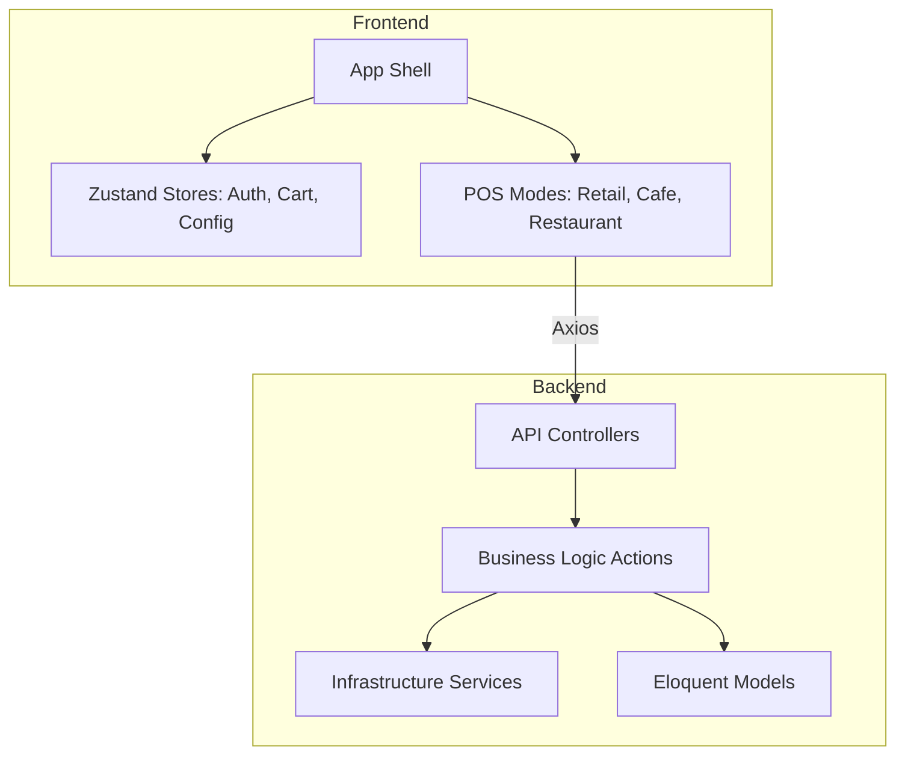
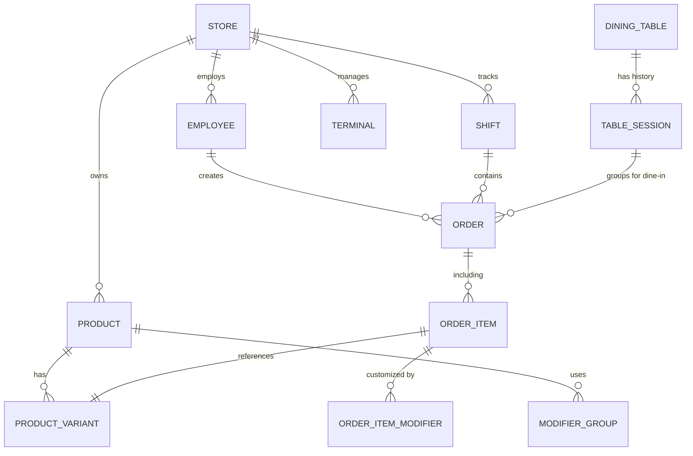
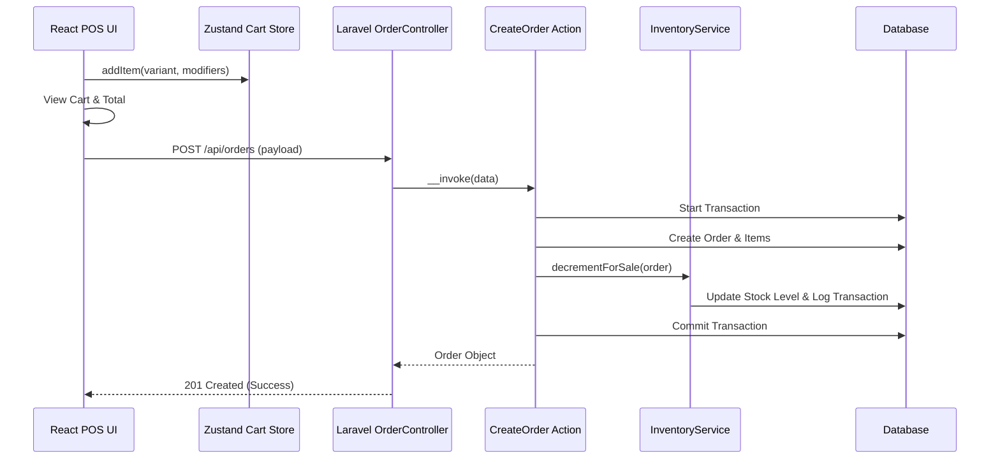
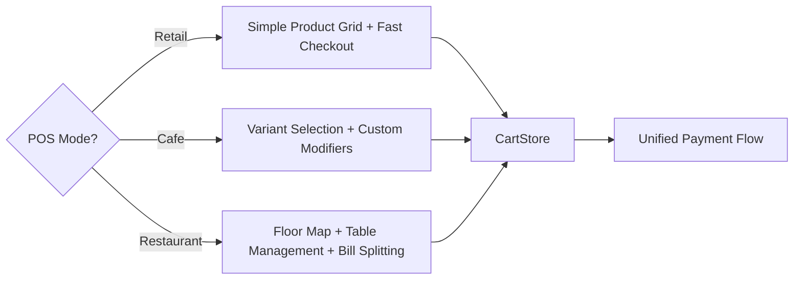

# ERP-POS System Review & Familiarization

A robust, multi-tenant POS system built with **Laravel 11** and **React 18**.

## Architecture Overview

The project is split into a modern decoupled architecture:
- **Backend**: Laravel REST API following an Action-Service pattern.
- **Frontend**: React Single Page Application (SPA) with Zustand for state management.

## Detailed Architecture

### Core Data Model
The system uses a multi-tenant relational schema optimized for POS operations.

### Order Request Flow
This diagram illustrates the lifecycle of a sale from the UI to the inventory ledger.

### POS Mode Logic
The application dynamically adapts its core interface based on the store's business type.

## Key Components

### 1. Multi-tenant Data Model
The system supports multiple stores and organizations. Every core entity (Employees, Products, Orders, Shifts) is scoped by a `store_id`.

### 2. Authentication System
- **PIN-based login**: Touch-optimized for POS terminals.
- **Role-based Access Control (RBAC)**: Supports roles like OWNER, MANAGER, CASHIER, WAITER, and KITCHEN.

### 3. POS Modes
The system transitions seamlessly between different business types:
- **Retail**: Grid-based product selection with direct checkout.
- **Cafe**: Support for complex product variants and modifier groups.
- **Restaurant**: Interactive floor map with table session management and bill consolidation.

### 4. Financial & Inventory Integrity
- **Money Handling**: Uses a custom `Money` utility to ensure decimal precision across PHP and JavaScript.
- **Tax System**: Snapshot-aware tax configuration ensures historical accuracy for orders even if store settings change.
- **Inventory Audit Trail**: Every stock change is recorded in an `inventory_transactions` ledger for full auditability.

## Technical Highlights

| Feature | Implementation Detail |
| :--- | :--- |
| **Framework** | Laravel 11 (Backend), React 18 (Frontend) |
| **State** | Zustand (highly performant and small boilerplate) |
| **Styling** | Tailwind CSS 4 with a custom touch-friendly design system |
| **Database** | Migration-based schema with integer-based money columns |
| **Concurrency** | Optimistic locking for inventory levels to prevent race conditions |

## Verification & Status
- **Backend Tests**: 22 passing tests covering core order and inventory logic.
- **Frontend Readiness**: Integrated with the API via a centralized client with token persistence.
- **Documentation**: Comprehensive installation and troubleshooting guides provided in the root.

---
*Review completed by Antigravity.*
